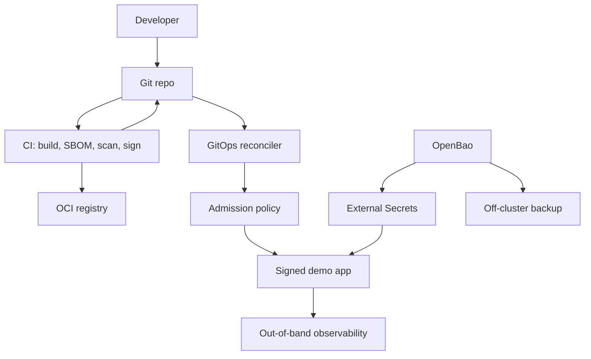

# MARDUK

MARDUK is a sanitized public portfolio export of a private Internal Developer
Platform lab.

It shows how managed-cloud platform controls can be reproduced on a homelab
budget: immutable Kubernetes nodes, GitOps, signed-image admission,
vault-backed secrets, default-deny networking, SLO burn-rate alerts,
off-cluster backups, preview environments, and local AI review.

**Honesty clause:** MARDUK is a simulated 3-node HA cluster on one hypervisor.
It proves platform control patterns and VM-level failure behavior. One physical
box is still one fate domain.

## Can I Clone This And Deploy The Full Platform Today?

Not yet.

You can clone this public repo and run a real public-safe proof ladder:

```bash
./deploy-marduk-public.sh public-proof
```

That command validates the starter, builds and tests the demo, renders
configuration, exercises disposable OpenBao and Kubernetes proofs, ships a
disposable backup, and proves local edge routing. It does not create real
Proxmox VMs, take over your DNS, configure your firewall, or ask for secrets.

The private MARDUK estate has been rebuilt from destroyed VMs to final verified
green in under 10 minutes with explicit human custody gates. A public turnkey
claim still needs a second, unrelated Proxmox proof with user-owned inputs.

## Why This Exists

Most homelab Kubernetes projects prove that containers can run. MARDUK tries to
prove the harder platform questions:

- Can the platform rebuild from declared state?
- Can Git be the intended write path?
- Can unsigned images be denied before they run?
- Can secrets stay out of Git?
- Can alerts, backups, and failure drills be tested instead of assumed?
- Can preview environments and local AI review work without paid cloud services?

The private repo contains operational detail and evidence. This public repo is
the safe version: demo app, starter templates, architecture, and public-safe
proofs without private topology or secret metadata.

## What MARDUK Demonstrates

| Area | Demonstrated pattern |
|------|----------------------|
| Infrastructure | Proxmox VM layer declared with Terraform |
| Node OS | Talos Linux nodes with pinned versions |
| Networking | Cilium CNI, load balancing, Gateway API, and policy |
| GitOps | Argo CD app-of-apps as the platform control loop |
| Supply chain | CI build, SBOM, CVE gate, signing, and digest write-back |
| Admission | Kyverno verifies image signatures and denies unsigned images |
| Secrets | OpenBao plus External Secrets keeps values out of Git |
| Network policy | Audit-first rollout to enforced default-deny |
| Observability | Out-of-band Prometheus and Grafana for SLO and capacity alerts |
| Backups | Vault snapshots shipped outside the cluster blast radius |
| Preview apps | Labelled pull requests create isolated public previews |
| Local AI review | A local model provides advisory review feedback |

## Current Proof Status

| Claim | Status |
|-------|--------|
| Private estate rebuilds from destroyed VMs | Proven privately |
| Private estate returns green after OpenBao restore | Proven privately |
| Unsigned platform image is denied | Proven privately |
| Git drift is reverted by GitOps | Proven privately |
| SLO and disk alerts fire for real | Proven privately |
| Node kill under load preserves the demo route | Proven privately |
| Public clean clone runs local proof ladder | Proven by `public-proof` |
| Public first-install OpenBao mechanics | Proven with disposable resources |
| Public ESO sync and secret seeding | Proven with disposable resources |
| Public backup ship path | Proven with disposable resources |
| Public edge route shape | Proven with disposable local proxy |
| Random Proxmox user deploys unchanged repo | Not proven yet |

Honest public wording:

> The private MARDUK estate is reproducible from code with explicit human custody
> and external-trust gates. This public repo is a sanitized starter with a
> clean-clone proof ladder, not yet a turnkey Proxmox installer.

## Architecture At A Glance



For the fuller sanitized diagram, see
[`docs/diagrams/marduk-public.mmd`](docs/diagrams/marduk-public.mmd).

## Repository Map

```text
apps/hello/                         Demo app used as a supply-chain carrier
deploy-marduk-public.sh             Public proof harness
Makefile                            Local proof helpers
compose.yaml                        Local container demo
docs/ARCHITECTURE-SANITIZED.md      Public architecture summary
docs/CONFIGURATION.md               Public config contract
docs/CLEAN-ROOM-PROOF.md            Proof ladder before turnkey claims
docs/DEPLOYABILITY.md               What is and is not deployable today
docs/EXTERNAL-GATES.md              Human-owned trust gates
docs/FAILOVER-DR-MATRIX.md          Recovery claim matrix
docs/EVIDENCE-SUMMARY.md            Evidence summary without private data
docs/PUBLIC-SAFETY.md               What was removed and why
docs/SCAN-REPORT.md                 Public export scan result
starter/                            Sanitized Terraform, Talos, Kubernetes, security
```

## Quickstart

Run the complete public-safe proof ladder:

```bash
make doctor
./deploy-marduk-public.sh public-proof
```

Run the smaller pieces manually:

```bash
make test
make starter-doctor
./deploy-marduk-public.sh plan
./deploy-marduk-public.sh render-terraform starter/config/marduk.env.example -
./deploy-marduk-public.sh openbao-plan
./deploy-marduk-public.sh render-openbao starter/config/marduk.env.example /tmp/marduk-openbao-bootstrap
./deploy-marduk-public.sh openbao-first-install-dry-run
make openbao-kubernetes-login-proof
make openbao-eso-sync-proof
make openbao-secret-seeding-proof
make openbao-backup-proof
make public-edge-proof
```

Run the demo app locally:

```bash
cd apps/hello
go run .
```

Then open:

```text
http://127.0.0.1:8080/
http://127.0.0.1:8080/healthz
```

Or run it with Docker:

```bash
make docker-build
make run-docker
```

## Build Your Own Private Version

Start by copying the starter into your own private operational repo:

```bash
cp -R starter my-marduk-ops
```

Then read these in order:

1. [`docs/CONFIGURATION.md`](docs/CONFIGURATION.md)
2. [`docs/CLEAN-ROOM-PROOF.md`](docs/CLEAN-ROOM-PROOF.md)
3. [`docs/EXTERNAL-GATES.md`](docs/EXTERNAL-GATES.md)
4. [`docs/FAILOVER-DR-MATRIX.md`](docs/FAILOVER-DR-MATRIX.md)
5. [`docs/GETTING-STARTED.md`](docs/GETTING-STARTED.md)
6. [`docs/BUILD-FROM-HERE.md`](docs/BUILD-FROM-HERE.md)
7. [`docs/BLUEPRINT-CHECKLIST.md`](docs/BLUEPRINT-CHECKLIST.md)

You must provide your own private values: Proxmox endpoint, network plan,
Talos secrets, DNS, registry, signing identity, OpenBao custody, backup target,
and external trust gates.

## What Is Not Included

This public export deliberately excludes:

- Private Git history.
- Terraform state and private operational manifests.
- Private deploy wrapper and recovery runbooks.
- Real domains, hostnames, usernames, IP ranges, service ports, and device names.
- Credential identifiers, token names, key fingerprints, secret paths, and
  custody locations.
- Screenshots, terminal captures, session logs, and troubleshooting logs.

The private operational repo should stay private. Publish this sanitized repo.

## Public Release Safety

The export has been checked with:

- gitleaks on the tracked export.
- gitleaks on the standalone public repo.
- Denylist scans for private estate domains, IPs, hostnames, identifiers, and
  credential metadata.
- Private-key and common token-prefix scans.
- Markdown em dash checks.

See [`docs/SCAN-REPORT.md`](docs/SCAN-REPORT.md) for the recorded scan result.
